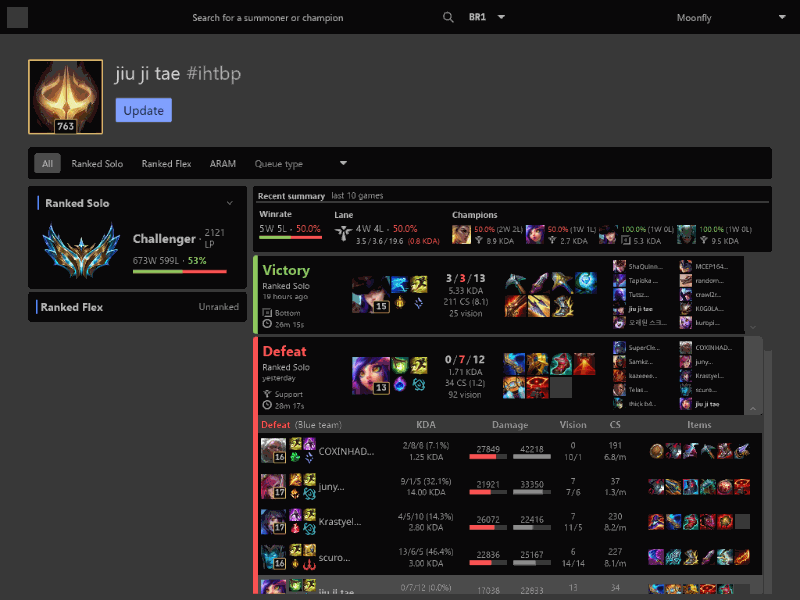

<div align="center">

# Aery
[](https://github.com/iced-rs/iced)

An open source, performant and ad-free companion app for League of Legends.


</div>

## Running

> [!WARNING]
> This is still extremely experimental and not ready for real-world usage.

As Riot Games prohibits using it's [Development API key](https://developer.riotgames.com/docs/portal#web-apis_api-keys) in a publicly available product and `backend` code is still a prototype, a `dummy` feature flag is available.

```bash
cargo run --features dummy
```

Using this flag will not make any requests, instead loading the `assets\dummy` folder and always returning a summoner search with the same `dummy` profile.

## Disclaimer

Aery is not endorsed by Riot Games and does not reflect the views or opinions of Riot Games or anyone officially involved in producing or managing Riot Games properties. Riot Games and all associated properties are trademarks or registered trademarks of Riot Games, Inc